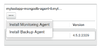
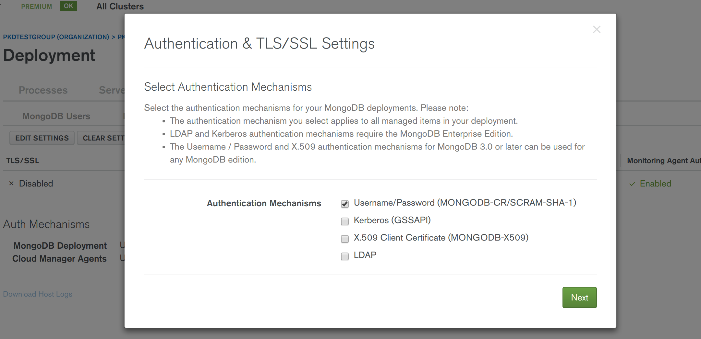
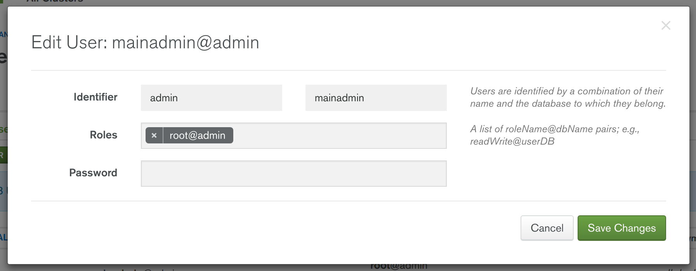
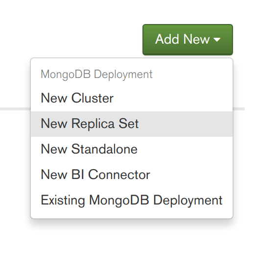
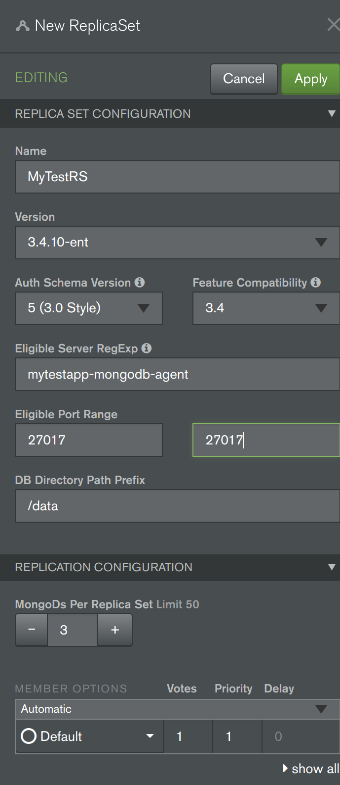
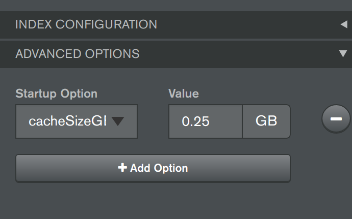

# MongoDB Cloud Manager with Kubernetes Demonstration

TODO: Provide links to Cloud Manager, Automation Agent, Kubernetes, GKE, StatefulSet, MongoDB ReplicaSet, mongod, Ops Manager)

An example project demonstrating the use of MongoDB Cloud Manager with via Kubernetes to deploy a MongoDB Replica Set. Uses the approach of deploying MongoDB Cloud Manager Agents as "skeleton" containers, provisioned as a Kubernetes StatefulSet. This enables the Cloud Manager UI (or API) to subsequently be used to deploy the MongoDB Replica Set's indvidual "mongod" processes to the "skeleton" containers. The example is specific to the Google Kuberneties Engine (GKE), however most of the outlined approach can be adopted for any Kubernetes environment. Likewise, the example uses MongoDB Cloud Manager, but most of the principles applied will likely to apply to the use of MongoDB Ops Manager, instead.

The project contains a Dockerfile and supporting scripts to generate a Docker container image that contains a MongoDB Cloud Manger Agent (in the 'automation-agent' folder). The project also contains example Kubernetes YAML resource files (in the 'resource' folder) and associated Kubernetes based Bash scripts (in the 'scripts' folder) to deploy the Cloud Manager Agents to the Kubernetes environment.

For further background information about running MongoDB with Kubernetes, see: [http://k8smongodb.net/](http://k8smongodb.net/)


## 1 How To Run

### 1.1 Prerequisites

Ensure the following dependencies are already fulfilled on your host Linux/Windows/Mac Workstation/Laptop:

1. An account has been registered with the Google Compute Platform (GCP). You can sign up to a [free trial](https://cloud.google.com/free/) for GCP. Note: The free trial places some restrictions on account resource quotas, in particular restricting storage to a maximum of 100GB.
2. An account has been registered with [Docker Hub](https://hub.docker.com/) (free to sign up). 
3. TODO: Sign up with Cloud Manager, inc. URL, and establish cloud mgr group id and api key
3. GCP’s client command line tool [gcloud](https://cloud.google.com/sdk/docs/quickstarts) has been installed. 
4. Your local workstation has Docker installed and running (either natively or in a VM). TODO: INSTALL LINK
5. Your local workstation has been initialised to: (1) use your GCP account, (2) install the Kubernetes command tool (“kubectl”), (3) configure authentication credentials, and (4) set the default GCP zone to be deployed to:

    ```
    $ gcloud init
    $ gcloud components install kubectl
    $ gcloud auth application-default login
    $ gcloud config set compute/zone europe-west1-b
    ```

**Note:** To specify an alternative zone to deploy to, in the above command, you can first view the list of available zones by running the command: `$ gcloud compute zones list`

### 1.2 Generate & Publish The Docker Image For The Cloud Manager Automation Agent

1. First the Docker image containing the Cloud Manger Automation Agent and associated startup script needs to be generated, using a command-line terminal/shell with the following commands (ensure the script files are set to be executable):

    ```
    $ cd automation-agent
    $ docker build -t XXXX/automation-agent.sh
    ```

**Note:** Replace 'XXXX' with your Docker Hub username (eg. 'jbloggs').

2. [OPTIONAL] Quickly test that the Docker image runs locally and can be connected to, with the main Cloud Manager Automation process listed as running:

    ```
    $ docker images
    $ docker run -d --name automation-agent-container -t XXXX/automation-agent /opt/mongodb-mms-automation/bin/mongodb-mms-automation-agent --mmsGroupId=YYYY --mmsApiKey=ZZZZ --mmsBaseUrl=https://cloud.mongodb.com -logLevel=INFO
    $ docker logs automation-agent-container
    $ docker exec -it automation-agent-container bash
    $ ps -ef
    $ exit
    $ docker stop automation-agent-container
    ```

**Note:** Replace 'XXXX', 'YYYY' & 'ZZZZ' with your Docker Hub username (eg. 'jbloggs'), your Cloud Manager Group ID and your Cloud Manager API key, respectively.

2. Publish the Docker image for the Cloud Manager Automation Agent to Docker Hub

    ```
    $ sudo docker login
    $ sudo docker push XXXX/automation-agent
    ```

**Note:** Replace 'XXXX' with your Docker Hub username (eg. 'jbloggs').

### 1.3 Deploy the Cloud Manager StatefulSet to Kubernetes

1. To create a Kubernetes cluster, create the required disk storage (and associated PersistentVolumes), and deploy the Cloud Manager Automation Agent Service (including the StatefulSet running "agent" containers), via a command-line terminal/shell run the following (ensure the script files are set to be executable):

    ```
    $ initialise_k8s.sh
    $ deploy_statefulset.sh
    ```
TODO: Change XXXX, YYYY & ZZZZ references in resource.yaml 

2. Once all the StatefulSet's 3 Cloud Manager Automation Agents are successfully running, the following command, when run will list the 3 pods for the 3 agents:

    $ kubectl get pods

You can also view the the state of the deployed environment via the [Google Cloud Platform Console](https://console.cloud.google.com) (look at both the “Container Engine” and the “Compute Engine” sections of the Console).

3. [OPTIONAL] Check that the one of the three Cloud Manager Automation Agents to see if it is running correct:

    ```
    $ kubectl logs mytestapp-mongodb-agent-0
    $ kubectl exec -it mytestapp-mongodb-agent-0 bash
    $ ps -ef
    $ exit
    ```

4. TODO: check that the 3 "servers/macines" are visible in cloud mgr


### 1.4 Configure The Cloud Manger Project & Deploy The MongoDB Replica-Set

Todo.
TODO: Say can also drive this via API LINK instead, but for this demo use UI for clarity. 

1. Log-on to your Cloud Manager LINK account and check that the 3 Kubernetes provisioned agents are appearing at 3 Servers listed in the Deployments section (similar to the screenshot below).


2. In the same Servers view of Cloud Manager, for each of the 3 Servers choose to install both: 1) Monitoring Agent, 2) Backup Agent (see screenshot below), ensuring you proceed with "Review & Deploy".



3. In the "Security | Authenitcation & TLS/SSL" tab of Cloud Manager, as per best practice, enable authentication for the whole project. Choose to "Edit Settings", tick "Username/Password (MONGODB-CR/SCRAM-SHA-1)" (see screenshow below), press "Next", press "Next" then press "Save" before proceeding with "Review & Deploy".



4. In the "Security | MongoDB Users" tab of Cloud Manager, choose the "Add New User" option, and proceed with adding a new administrator ready for adminstrating the  MongoDB Replica Set that will be subsequently deployed. Specify whatever username and password you desire, for the "database" field, specific "admin" and for the role specify "root@admin" (see screenshot below). Press "Add User" then proceed with "Review & Deploy".



5. Now its time to deploy a new MongoDB ReplicaSet. Back in the Deployments "Servers" tab, press the "Add New" button and select "New Replica Set" (see first screenshot below). Fill out details for the replica-set (similar to second screenshot below), including specifying a "Name" for the replica set, a value of "mytestapp-mongodb-agent" for the "Eligible Server RegExp" field to target the 3 Kubernetes provisioned servers, "27017" for both of the "Eligible Port Range" fields. Scroll down to the base of the "New Replica Set wizard" and expand the "Advanced Options" section, then add an option to limit wired tiger cache size (very impirant when running mongodb within containers) by adding the field storageWiredTigerEngineConfig->cacheSizeGB" set to the value "0.25" (see third screenshot below). FInally back at the top of the "wizard" press "Apply" and then proceed with "Review & Deploy". Half a minite or so later your MongoDB Replica Set should be deployed and running (feel free to explore the Cloud Manager's Monitoring UI for this newly deployed replica set).





6. Now you can enable backups for the running MongoDB Replica Set. Select the "Backups" section from the left side of Cloud Manager's UI and for the listed newly deployed replica set, press the "Start" button (see screenshot below).


7. [OPTIONAL] To test that Cloud Manager's rolling update automation feature works correctly for the deployed replica set running on Kubernetes containers, back in the "Deployments - Processes" part of the Cloud Manager UI, for the deployed replica set, press the "Modify" button and make a configuration change that would result in the need for a rolling update (eg. change the version number to a lower version, such as 3.4.10 -> 3.4.9) select to "Apply" and then proceed with "Review & Deploy". Half a minute or so later, the change (eg. the downgrade") will have completed and the replica set will be displayed in its new state in the Cloud Manager UI. 

8. [OPTIONAL] From the command line, view the automation agent's logs for the first Kubernetes provisioned container to see a verbose output of all the task the agent performed to fulfil the previous Cloud Manager initiated actions:

    ```
    $ kubectl logs mytestapp-mongodb-agent-0
    ```


### 1.5 Undeploying & Cleaning Down the Cloud Manager & Kubernetes Environment

**Important:** This step is required to ensure you aren't continuously charged by Google Cloud for an environment you no longer need.

1. In Cloud Manager, perform the following steps to stop and remove the MongoDB Replica Set, undeploy the agents and de-register the Kubernetes provisioned "servers2 (Containers) from the Cloud Manager Project: 1) Disable backup for the replica set, 2) shutdown the replica set, 3) for the replica set choose to Remove From Cloud Manager (Completely remove from Cloud Manager), 4) for the cloud manager project as a whole choose to "Unmanage All".

2. Run the following script to undeploy the Cloud Manager Automation Agent Service & StatefulSet plus related Kubernetes resources, followed by the removal of the GCE disks before finally deleting the GKE Kubernetes cluster.

    $ ./undeploy_statefulset.sh
    $ ./teardown_k8s.sh
    
It is also worth checking in the [Google Cloud Platform Console](https://console.cloud.google.com), to ensure all resources have been removed correctly.


## 2 Factors Addressed By This Project

* TODO: check and revise
* Deployment of a MongoDB on GKE's Kubernetes platform
* Use of Kubernetes StatefulSets and PersistentVolumeClaims to ensure data is not lost when containers are recycled
* Proper configuration of a MongoDB Replica Set for full resiliency
* Securing MongoDB by default for new deployments
* Leveraging XFS filesystem for data file storage to improve performance
* Disabling Transparent Huge Pages to improve performance
* Disabling NUMA to improve performance
* Controlling CPU & RAM Resource Allocation
* Correctly configuring WiredTiger Cache Size in containers
* Controlling Anti-Affinity for Mongod Replicas to avoid a Single Point of Failure


## 3 Dicussions Points / Subjects to Highlight

* TODO


