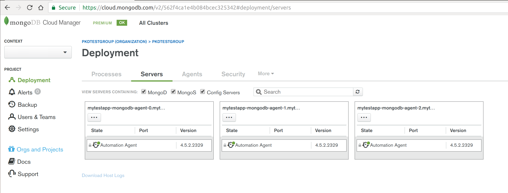
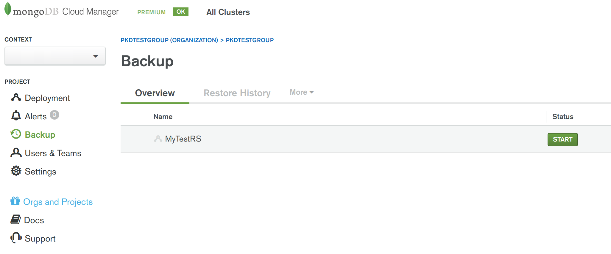

# MongoDB Cloud Manager with Kubernetes Demonstration

An example project demonstrating the use of MongoDB [Cloud Manager](https://www.mongodb.com/cloud/cloud-manager) with [Kubernetes](https://kubernetes.io/) to deploy a [MongoDB Replica Set](https://docs.mongodb.com/manual/core/replica-set-members/). Uses the approach of deploying MongoDB Cloud Manager [Automation Agents](https://docs.cloudmanager.mongodb.com/tutorial/nav/automation-agent/) as "skeleton" [Docker containers](https://www.docker.com/what-container), provisioned as a Kubernetes [StatefulSet](https://kubernetes.io/docs/concepts/workloads/controllers/statefulset/). This enables the Cloud Manager UI (or API) to subsequently be used to deploy the MongoDB Replica Set's individual "mongod" processes, to the "skeleton" containers. This example project is specific to the [Google Kubernetes Engine](https://cloud.google.com/kubernetes-engine/) (GKE), however, most of the outlined approach can be adopted for any other Kubernetes host environment. Likewise, the example project uses MongoDB Cloud Manager, but most of the principles applied can be transferred to the use of MongoDB [Ops Manager](https://docs.opsmanager.mongodb.com/current/application/), instead (i.e. to the on-prem version of Cloud Manager).

The project contains a [Dockerfile](https://docs.docker.com/engine/reference/builder/) and a supporting container entrypoint "wrapper" Bash script to generate a [Docker container image](https://docs.docker.com/engine/userguide/eng-image/baseimages/), containing a MongoDB Cloud Manager Automation Agent (in the 'automation-agent' folder of this project). The project also contains example Kubernetes YAML resource files (in the 'resource' folder) and associated Kubernetes based Bash scripts (in the 'scripts' folder), to deploy the Cloud Manager Automation Agents to the Kubernetes environment.

For further background information about running MongoDB with Kubernetes, see: [http://k8smongodb.net/](http://k8smongodb.net/)


## 1 How To Run

### 1.1 Prerequisites

Ensure the following dependencies are already fulfilled on your host Linux/Windows/Mac Workstation/Laptop:

1. An account has been registered with the Google Compute Platform (GCP). You can sign up to a [free trial](https://cloud.google.com/free/) for GCP. Note: The free trial places some restrictions on account resource quotas, in particular restricting storage to a maximum of 100GB.
2. An account has been registered with [Docker Hub](https://hub.docker.com/) (free to sign up). 
3. An account has been registered with MongoDB's Cloud Manager service. You can sign up to a [free trial](https://cloud.mongodb.com/user#/register/accountProfile) for Cloud Manager. One registered, an [Agent API Key](https://docs.cloudmanager.mongodb.com/tutorial/manage-agent-api-key/) needs to be created in the Cloud Manager UI's "Deployments | Agents | Agent API Keys" section. 
4. GCP’s client command line tool [gcloud](https://cloud.google.com/sdk/docs/quickstarts) has been installed. 
5. Your local workstation has [Docker installed](https://docs.docker.com/engine/installation/) (Community Edition) and running (either natively or in a VM). 
6. Your local workstation has been initialised to: (1) use your GCP account, (2) install the Kubernetes command tool (“kubectl”), (3) configure authentication credentials, and (4) set the default GCP zone to be deployed to:

    ```
    $ gcloud init
    $ gcloud components install kubectl
    $ gcloud auth application-default login
    $ gcloud config set compute/zone europe-west1-b
    ```

 **Note:** To specify an alternative zone to deploy to, in the above command, you can first view the list of available zones by running the command: `$ gcloud compute zones list`


### 1.2 Generate & Publish The Docker Image For The Cloud Manager Automation Agent

1. First the Docker image containing the Cloud Manger Automation Agent and associated startup script needs to be generated, using a command-line terminal/shell with the following commands (ensure the script files are set to be executable):

    ```
    $ cd automation-agent
    $ docker build -t XXXX/automation-agent .
    ```

 **Note:** Above, replace 'XXXX' with your Docker Hub username (e.g. 'jbloggs').

2. **OPTIONAL:** Quickly test that the Docker image runs locally and can be connected to, with the main Automation Agent's OS process shown as running:

    ```
    $ docker images
    $ docker run -d --name automation-agent-container -t XXXX/automation-agent /opt/mongodb-mms-automation/bin/mongodb-mms-automation-agent --mmsGroupId=YYYY --mmsApiKey=ZZZZ --mmsBaseUrl=https://cloud.mongodb.com -logLevel=INFO
    $ docker logs automation-agent-container
    $ docker exec -it automation-agent-container bash
    $ ps -ef
    $ exit
    $ docker stop automation-agent-container
    $ docker logs automation-agent-container
    ```

 **Note:** Above, replace 'XXXX', 'YYYY' & 'ZZZZ' with your Docker Hub username (e.g. 'jbloggs'), your Cloud Manager GroupID (a.k.a. ProjectID, see "Settings | Project Settings" part of the Cloud Manager UI) and your Cloud Manager API key (you created in the 1.1 Prerequisites section above), respectively.

3. Publish the Docker image for the Cloud Manager Automation Agent, to Docker Hub

    ```
    $ sudo docker login
    $ sudo docker push XXXX/automation-agent
    ``` 

 **Note:** Above, replace 'XXXX' with your Docker Hub username (e.g. 'jbloggs').


### 1.3 Deploy the Cloud Manager StatefulSet to Kubernetes

1. In the YAML resource file that define's the Kubernetes StatefulSet ('resources/mongodb-agent-service.yaml') replace the following text elements with the corresponding values for your environment and save the changes:


    ```
    XXXX: Your Docker Hub username (e.g. 'jbloggs')
    YYYY: Your Cloud Manager GroupID (a.k.a. ProjectID)
    ZZZZ: Your Cloud Manager API key
    ```

2. To create a Kubernetes cluster, create the required disk storage (and associated PersistentVolumes), and deploy the Cloud Manager Automation Agent Service (which includes the StatefulSet "agent" containers), via a command-line terminal/shell run the following (ensure the script files are set to be executable):


    ```
    $ ./initialise_k8s.sh
    $ ./deploy_statefulset.sh
    ```

3. Once all the StatefulSet's 3 Cloud Manager Automation Agents are successfully running, run the following command to list the 3 pods for the 3 agents:

    ```
    $ kubectl get pods
    ```

 You can also view the the state of the deployed environment via the [Google Cloud Platform Console](https://console.cloud.google.com) (look at both the “Kubernetes Engine” and the “Compute Engine” sections of the Console).

4. **OPTIONAL:** Check one of the three running Cloud Manager Automation Agent Pods (Containers) to see if it is running correctly:

    ```
    $ kubectl logs mytestapp-mongodb-agent-0
    $ kubectl exec -it mytestapp-mongodb-agent-0 bash
    $ ps -ef
    $ exit
    ```


### 1.4 Configure The Cloud Manger Project & Deploy The MongoDB Replica-Set

In this section you will use the Cloud Manager UI to check that the 3 Cloud Manager Automation Agent Pods (Containers) are visible to Cloud Manager as 3 "servers", and then you will deploy monitoring agents, backup agents, and a MongoDB Replica Set to these containers/servers. Alternatively, you could use the [Cloud Manager API](https://docs.cloudmanager.mongodb.com/core/api/) to automate all these steps, yourself.

1. Log-on to your Cloud Manager LINK account and check that the 3 Kubernetes provisioned agents are appearing at 3 Servers listed in the Deployments section (similar to the screenshot below).



2. In the same Servers view of Cloud Manager, for each of the 3 Servers choose to install both: 1) Monitoring Agent, 2) Backup Agent, ensuring you proceed with "Review & Deploy" (see screenshot below).


3. In the "Security | Authentication & TLS/SSL" tab of Cloud Manager, as per best practice, enable authentication for the whole project. Choose to "Edit Settings", tick "Username/Password (MONGODB-CR/SCRAM-SHA-1)" (see screenshot below), press "Next", press "Next" again and then press "Save" before proceeding with "Review & Deploy".


4. In the "Security | MongoDB Users" tab of Cloud Manager, choose the "Add New User" option, and proceed with adding a new administrator ready for administrating the  MongoDB Replica Set that will be subsequently deployed. Specify whatever username and password you desire. For the "database" field, specific "admin" and for the role specify "root@admin" (see screenshot below). Press "Add User" then proceed with "Review & Deploy".


5. Now its time to deploy a new MongoDB Replica Set. Back in the Deployments "Servers" tab, press the "Add New" button and select "New Replica Set" (see first screenshot below). Fill out details for the replica-set (similar to second screenshot below), including specifying a "Name" for the replica set, a value of "mytestapp-mongodb-agent" for the "Eligible Server RegExp" field to target the 3 Kubernetes provisioned containers/servers, and "27017" for both of the "Eligible Port Range" fields. Scroll down to the base of this "New Replica Set wizard" and expand the "Advanced Options" section, then add an option to limit wired tiger cache size (very important when running mongodb within containers) by adding the field "storageWiredTigerEngineConfig->cacheSizeGB" set to the value "0.25" GB (see third screenshot below). Finally back at the top of the "wizard" press "Apply" and then proceed with "Review & Deploy". Approximately half a minute, your MongoDB Replica Set should be deployed and running (feel free to explore the Cloud Manager's Monitoring UI for this newly deployed replica set to view the health of the replica set).


6. Now you can enable backups for the newly running MongoDB Replica Set. Select the "Backups" section from the left side of Cloud Manager's UI and for the listed for the replica set, press the "Start" button (see screenshot below).



7. **OPTIONAL:** To test that Cloud Manager's rolling update automation feature works correctly for the deployed replica set running on Kubernetes containers, back in the "Deployments - Processes" part of the Cloud Manager UI, for the deployed replica set, press the "Modify" button. Now make a configuration change that will result in the need for a rolling update to be performed (eg. change the version number to a lower version, e.g. 3.4.10 -> 3.4.9) select to "Apply" and then proceed with "Review & Deploy". Half a minute or so later, the change (eg. the "downgrade") will have completed and the replica set will be displayed in its new state, in the Cloud Manager UI. 

8. **OPTIONAL:** From the command line, view the automation agent's logs for the first Kubernetes provisioned container to see a verbose logs of all the tasks that the agent has performed to fulfil the all of the Cloud Manager initiated actions:

    ```
    $ kubectl logs mytestapp-mongodb-agent-0
    ```


### 1.5 Undeploying & Cleaning Down the Cloud Manager & Kubernetes Environment

**Important:** This step is required to ensure you aren't continuously charged by Google Cloud for resoueces you no longer need.

1. In Cloud Manager, perform the following steps to stop and remove the MongoDB Replica Set, undeploy the agents and deregister the Kubernetes provisioned "servers" (containers) from the Cloud Manager Project: 1) Disable backup for the replica set, 2) Shutdown the replica set, 3) For the replica set choose to "Remove From Cloud Manager" ("Completely remove from Cloud Manager"), 4) for the Cloud Manager overall project choose to "Unmanage All".

2. Run the following script to undeploy the Cloud Manager Automation Agent Service & StatefulSet plus related Kubernetes resources, followed by the removal of the GCE disks, before the GKE Kubernetes cluster is finally deleted.

    ```
    $ ./undeploy_statefulset.sh
    $ ./teardown_k8s.sh
    ```
    
It is also worth checking in the [Google Cloud Platform Console](https://console.cloud.google.com), to ensure all resources have been removed correctly.


## 2 Factors Addressed By This Project

* Deployment of a MongoDB on GKE's Kubernetes platform
* Use of Kubernetes StatefulSets and PersistentVolumeClaims to ensure data is not lost when containers are recycled
* Proper configuration of a MongoDB Replica Set for full resiliency
* Securing MongoDB by default for new deployments
* Leveraging XFS filesystem for data file storage to improve performance
* Disabling Transparent Huge Pages to improve performance
* Disabling NUMA to improve performance
* Controlling CPU & RAM Resource Allocation
* Correctly configuring Mongod WiredTiger Cache Size in containers
* Controlling Anti-Affinity for Automation Agents hosting a particular set of Mongod replicas, to avoid a Single Point of Failure
* Allow automated upgrades of Automation Agents without causing host containers to die (due to use of entrypoint "wrapper" Bash script)


## 3 Discussions Points / Subjects to Highlight

* Thought and care needs to be given on the optimum process to use when upgrading the agent "skeleton" containers (e.g. to pick up a newer base image containing OS security and performance patches). Using a "standard" StatefulSet upgrade process, Kubernetes will not be aware to first rotate hosts for each MongoDB Replica Set Secondary, before performing a "step-down" on the Primary. Also, the standard process will not know to wait between terminating and restarting one host pod/container, to allow the replica it contains to "catch-up on the Oplog", before terminating the next host pod/container. As a result, without careful planning, some data inserted into the DB during the upgrade process, is at risk of being lost. At the very least, client applications will suffer longer periods of "database unavailability" than usually expected.
* Once a MongoDB Replica Set has been deployed to the "skeleton" agent containers, the Cloud Manager UI will show a warning that the database processes are running as root user. This warning can be ignored, as this is the normal approach to use when adopting Containerisation, where each container runs just a single "primary" process.

